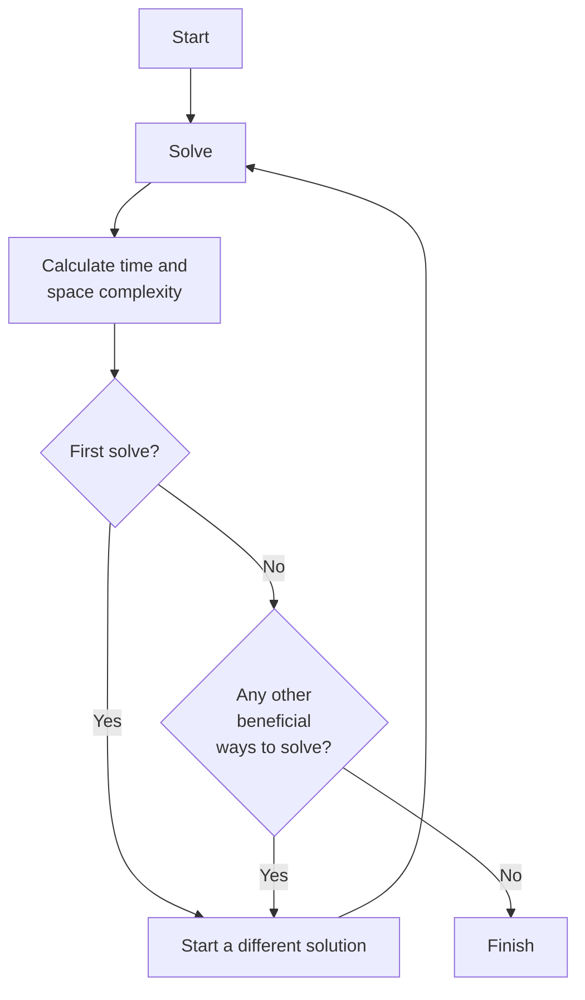

# Leet Code Flow

This is my personal approach for getting the most out of solving Leet Code problems.

I have no set rules for deciding subsequent solutions to the problem, it could be one of:
- Trying out a different way to solve the problem (e.g. iterative vs recursive).
- Attempting to improve on runtime and/or memory performance. Inspiration could be taken from other solutions.
- Trying to write a solution that is more readable/testable/etc.
- Trying a solution in a different language.
- A combination of the above reasons or any number of other reasons.

